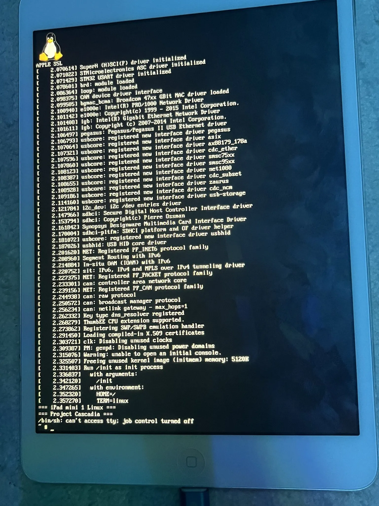

# Project Cascadia
Native Linux on Apple A5 — the first step of the Cascadia project (A5 → A6 → A12/A13)

# Project Cascadia — Native Linux on Apple A5

> **Status: Phase 1 Complete — Linux boots to shell**

## What is this?

Cascadia is an attempt to run native, mainline Linux on Apple A5-based
devices — starting with the iPad mini 1 (iPad2,5).

As of writing, no prior Linux port exists for the A5 (S5L8942X).
PostmarketOS covers A8+, Project Sandcastle targeted A10, but A5 has
been a complete blind spot. Cascadia aims to change that.

The goal is not just to boot Linux — it's to build a foundation for
future ports to A6, A10, and eventually A12/A13 (via usbliter8),
documenting everything along the way so others can build on it.

## Why A5?

- checkm8 BootROM exploit covers A5 (permanent, hardware-level)
- No prior Linux work — genuinely uncharted territory
- A5 uses Samsung-derived IP blocks (UART, cache) with partial
  open documentation — more approachable than newer Apple-custom silicon
- PowerVR SGX543 GPU has some open documentation (future goal)

## Supported Devices

| Device | Model | Chip | Board ID |
|--------|-------|------|----------|
| iPad mini 1 (Wi-Fi) | iPad2,5 / A1432 | Apple A5 (S5L8942X) | p105ap |

More devices planned as the project matures.

## Current Status

- [x] checkm8 via Raspberry Pi Pico (checkm8-a5)
- [x] Full boot chain: primepwn → autogo iBEC → staging-bundle → Linux
- [x] Linux 6.12 kernel boots on hardware
- [x] Apple DeviceTree fully parsed, all hardware addresses extracted
- [x] Custom Linux DTS (memory, UART0, AIC1, simplefb, PL310 L2)
- [x] Custom AIC1 interrupt controller driver
- [x] PMCCNTR clocksource (Cortex-A9 cycle counter)
- [x] Serial output via DCSD cable — kernel logs confirmed
- [x] simplefb framebuffer — /dev/fb0 registered, Tux on screen
- [x] Alpine Linux 3.24 embedded initramfs
- [x] Interactive shell on tty0 (framebuffer console)
- [ ] USB networking (OTG PHY needs driver)
- [ ] CPU1 / SMP bringup (entry point research in progress)
- [ ] WiFi (BCM4334 via SDIO)
- [ ] Touch input

## Roadmap

**Phase 1 ✓:** Linux boots to interactive shell. Serial logs. Framebuffer console.
**Phase 2 (current):** USB gadget ethernet → SSH → package manager → fastfetch.
**Phase 3:** CPU1 SMP bringup. WiFi via brcmfmac.
**Phase 4:** A6 port (iPhone 5 / iPad mini 2). Build on Phase 1 foundation.
**Phase 5:** A12/A13 via usbliter8 (longer term).

## Technical Notes

Hardware addresses extracted directly from Apple's DeviceTree:

| Peripheral | Physical Address | Notes |
|-----------|-----------------|-------|
| UART0 | 0x32500000 | boot-console, earlycon=s3c6400 |
| AIC | 0x3F200000 | Custom aic,1 driver (not mainline) |
| PL310 L2 | 0x3E000000 | Disabled — hangs with L1 D-cache off |
| Framebuffer | 0x9F6FC000 | 768×1024, stride 3072, BGRA8888 |
| RAM base | 0x80000000 | 512MB |

Boot chain uses autogo-patched iBEC (teutekeune/iBSSloader) +
staging-bundle (linux-boot loader + zImage-dtb at 0x80008000).

## Background

In May 2026, while looking for existing Linux ports for the iPad mini 1,
I found nothing. PostmarketOS stops at A8, Project Sandcastle targeted A10,
and the A5 had been completely ignored — likely because it's 32-bit, old,
and "not worth it".

That's exactly why it's interesting.

The A5 (S5L8942X) is covered by checkm8, uses Samsung-derived IP blocks
with partial open documentation, and has PowerVR SGX543 GPU which has more
public info than Apple's custom silicon. It's arguably one of the more
approachable chips for a from-scratch Linux port.

This project started as an experiment to see how far you can get.
Turns out — pretty far.

## Credits

- **teutekeune** — iBSSloader: useful info - kernel patches, boot chain, AIC1 driver
- **axi0mX** — checkm8 BootROM exploit
- **LukeZGD** — Legacy iOS Kit, EverPwnage, checkm8-a5 Pico firmware
- **NyanSatan** — checkm8_bootkit, iBoot research
- **iH8sn0w** — iBoot32Patcher

## License

GPL-2.0
