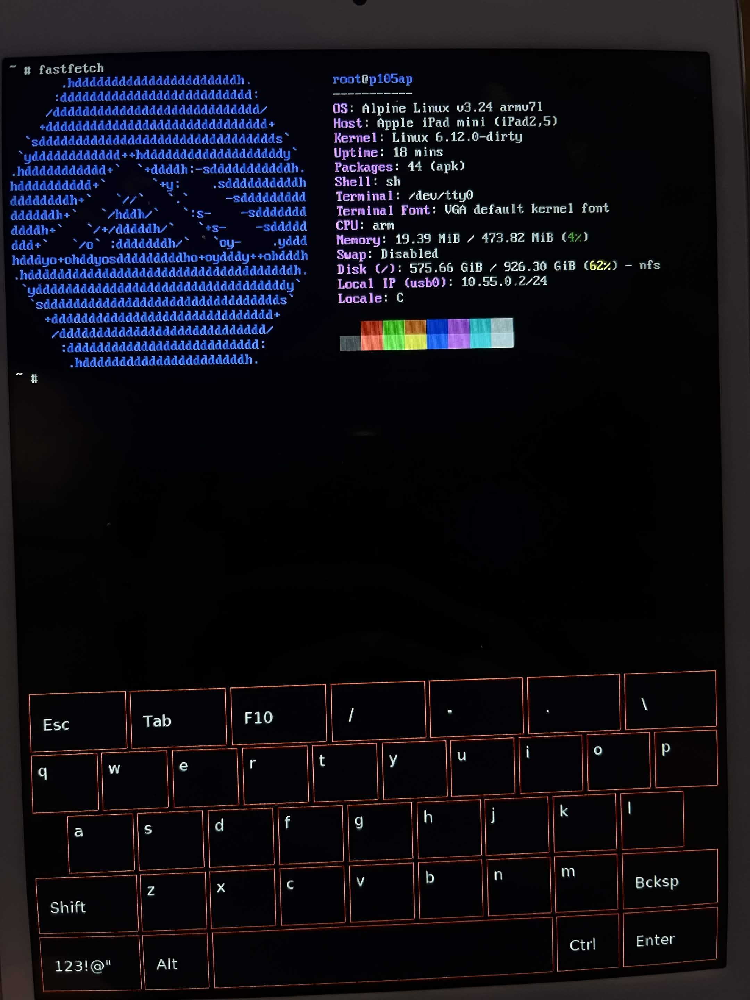
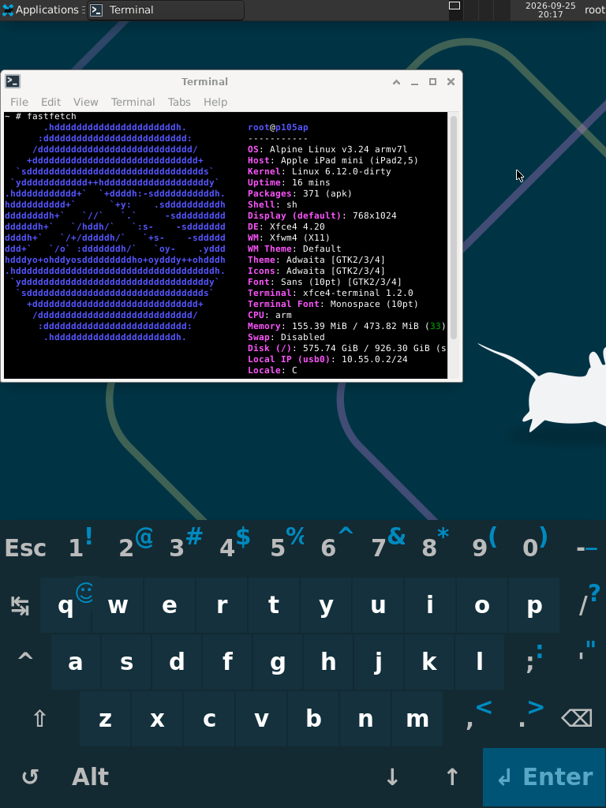

# Project Cascadia — Native Linux on Apple A5

Mainline Linux 6.12 on an iPad mini 1 (iPad2,5 / S5L8942X), booting to an
interactive shell — on the glass and over USB — and on to an XFCE desktop you
drive with your fingers.

> **Status: Phases 1 & 2 complete, Phase 3 all but Wi-Fi.** Linux boots on both
> cores, takes interrupts, keeps time, gives you a shell and a network over the
> Lightning cable, takes multi-touch, and runs XFCE with an on-screen keyboard.


## What is this?

Cascadia is an attempt to run native, mainline Linux on Apple A5-based devices —
starting with the iPad mini 1 (iPad2,5).

As far as I can tell, no prior Linux port exists for the A5 (S5L8942X).
postmarketOS covers A8+, Project Sandcastle targeted A10; the A5 has been a
blind spot. Cascadia aims to change that.

The goal is not just to boot Linux — it's to build a foundation for future
ports to A6, A10 and eventually A12/A13, documenting everything along the way,
including the parts that didn't work.

## Why A5?

- checkm8 BootROM exploit covers A5 (permanent, hardware-level)
- No prior Linux work — genuinely uncharted territory
- A5 uses Samsung-derived IP blocks (UART, cache) with partial open
  documentation — more approachable than newer Apple-custom silicon
- PowerVR SGX543 GPU has some open documentation (future goal)

## Supported Devices

| Device | Model | Chip | Board ID |
|--------|-------|------|----------|
| iPad mini 1 (Wi-Fi) | iPad2,5 / A1432 | Apple A5 (S5L8942X) | p105ap |

## Current Status

- [x] checkm8 via Raspberry Pi Pico (checkm8-a5)
- [x] Full boot chain: primepwn → autogo iBEC → staging-bundle → Linux
- [x] Linux 6.12 boots on hardware
- [x] Apple DeviceTree fully parsed, all hardware addresses extracted
- [x] Custom Linux DTS (memory, UART0, AIC1, simplefb, PL310 L2, dwc2, SPI, I2C)
- [x] Custom AIC1 interrupt controller driver
- [x] **Interrupts actually reach the CPU** — see *The AIC problem* below
- [x] **A working system tick** — the AIC's own timer, read out of iBoot; see *The timer problem* below
- [x] **Correct wall-clock time** — calibrated 24 MHz clocksource + sched_clock
- [x] Serial output via DCSD cable — kernel logs confirmed
- [x] simplefb framebuffer — `/dev/fb0`, Tux on screen, blinking cursor
- [x] Alpine Linux 3.24 embedded initramfs
- [x] Interactive shell on tty0 (framebuffer console)
- [x] **USB gadget enumerates** — dwc2 peripheral mode, full SET_CONFIGURATION
- [x] **Interactive shell over USB** — CDC ACM, `screen /dev/cu.usbmodem* 115200`
- [x] **USB networking** — CDC ECM on the same port as the console (`g_cdc`),
      10.55.0.2, ~0.7 ms RTT to the host
- [x] **SSH** — dropbear, key-only, over the ECM link
- [x] **`apk` works on the device** — the whole Alpine repository, over the cable
- [x] **NFS root** — the root filesystem lives on the host's disk, so installed
      packages survive a reboot and the disk is no longer 512 MB of RAM
- [x] `/bin/peek` — MMIO poke tool in the initramfs for live hardware probing
- [x] **The boot chain regenerates from a stock IPSW** — `./cascadia firmware`
      decrypts and patches iBSS/iBEC from the user's own firmware, verified
      byte-for-byte and booted on hardware. No Apple binaries in this repository
- [x] **Touch** — multi-touch on `/dev/input/event0`, 60 Hz, up from boot. The
      digitizer is brought up the way iOS does it, recorded from iOS's own
      driver trace. The digitizer's firmware comes out of the user's IPSW with
      the boot chain; the panel's calibration is a default one, or the iPad's
      own from its jailbroken iOS (`./cascadia mtcal`, optional). See
      `docs/research/p105-z2-boot.md`
- [x] **On-screen keyboard** — `fbkeyboard` under the console on the glass,
      started at boot once it is installed on the NFS root (no arrow keys)
- [x] **A desktop** — XFCE on the framebuffer, touch as the pointer (a
      two-finger tap is a right click), `svkbd` as the keyboard behind a panel
      button. One script sets it up: `tools/desktop/xfce-setup.sh`, then
      `desktop`. Software rendered; see QUICKSTART
- [x] **Linux hosts** — build, flash, `./cascadia net` and `./cascadia nfs` on
      Linux as well as macOS (walked on Arch; Ubuntu used by a second tester)
- [x] **Both cores** — CPU1 comes up at boot, idles the way XNU does, and
      hotplugs off and on; see *The idle problem* below
- [ ] Wi-Fi (BCM4334 — HSIC, behind EHCI, not SDIO as initially assumed)
- [ ] USB host mode / keyboard — no free host port: dwc2 in host mode would take the console and the network with it

## Four problems worth reading about

Most of the interesting work in this port was not writing drivers. It was
finding out why perfectly correct drivers did nothing.

### 1. The AIC problem — no interrupt ever reached the CPU

For weeks, `/proc/interrupts` was zero on every line, IPIs included. USB never
enumerated, touch never fired. The working theory was a hardware gap between
the AIC output and the CPU's nIRQ pin.

It was not hardware. `kernel_init()` carries two Apple-specific blocks, and the
second one runs immediately before `do_initcalls()`:

```c
apple_aic1_quiesce();           /* MASK_SET all, TARGET_CPU=0 all, drain, CFG &= ~ENABLE */
apple_aic1_hw_quiesce_quiet();  /* ...and again through a static mapping */
early_boot_irqs_disabled = false;
local_irq_enable();
```

Nothing turns the controller back on. By the time any driver called
`request_irq()`, `AIC1_CONFIG.ENABLE` was 0 and every line's `TARGET_CPU` was 0 —
no core selected. A second, independent bug: `aic1_irq_unmask()` wrote only
`MASK_CLR` and never touched `TARGET_CPU`, so even an unmasked line had no route.

The fix is `apple_aic1_rearm()` — mask every line, point every `TARGET_CPU` at
CPU0, drain `EVENT`, unmask IPIs, re-enable the controller — called right before
`early_boot_irqs_disabled = false`, plus a `TARGET_CPU` write in the unmask path.

```
AIC1-REARM: CONFIG=0x10773 (ENABLE=1) all lines masked, TARGET=CPU0, IPI live
LATE-SMOKE: CPSR=0xa0000053 (I=0) handler_entries=27
IRQ: 50:  116  APPLE-AIC1  11 Edge  36100000.usb
```

27 real hardware interrupts had already been taken before the smoke test even
ran. The hardware had been fine the whole time.

### 2. The timer problem — the timer was in the one block nobody scanned

With interrupts working, the system still had no clockevent: `jiffies` frozen,
`msleep()` never returning, `sleep` hanging forever. Every timer the datasheets
and the device tree pointed at was tried on real hardware, and every one of
them failed (table below).

For a while the tick came from an unlikely place: **the USB controller's
Start-of-Frame interrupt**. At high speed dwc2 sees one SOF per 125 µs
microframe — a free, hardware-accurate 8 kHz interrupt — and a clockevent built
on it made `sleep` work. The first sign it worked wasn't a log line; it was the
framebuffer cursor starting to blink. It also meant no tick at all without a
USB host enumerating the gadget, and 8000 interrupts a second to pay for it.

The real timer lives inside the interrupt controller, and the way to it was to
read iBoot rather than XNU. XNU reaches hardware through IOKit mappings and
never names a register; iBoot uses literal addresses, so its AIC driver in
iBEC reads straight off the page:

```
timer_get_ticks   hi=[AIC+0x28]; lo=[AIC+0x20]; hi2=[AIC+0x28]; retry while hi != hi2
tick_rate         return 24000000
deadline_enter    [+0x2014]=~0; [+0x2010]|=1; [+0x2018]=1; [+0x2014]=deadline-now
timer ISR         [+0x2010]&=~1; [+0x2018]|=1; callback()
IRQ dispatch      EVENT 0x00070001 -> the timer
```

A 64-bit timebase at 24 MHz, and a one-shot countdown that fires as an AIC
event of a type — 7 — the Linux driver had never been told about. Linux drives
it through the per-CPU copy of that block at `AIC+0x5010`; the alias at
`+0x2010` that iBoot uses reads as zeros from Linux. It registers only after a
self-test shot comes back:

```
AIC-TIMER: cpu0 window 0x5000: a 10 ms shot fired after 10003 us (CFG was 0x0)
AIC-TIMER: PASS -- clockevent registered at 24 MHz, rating 400.
```

The SOF tick is kept as the fallback for a boot where that self-test fails.
Otherwise it costs nothing: dwc2 enables Start-of-Frame interrupts only when
the AIC timer did not come up.

### 3. The clock problem — `sleep 1` took 14 seconds

With a tick running, wall-clock time was still wrong by an order of magnitude.
The clocksource was PMCCNTR, the Cortex-A9 cycle counter — and PMCCNTR **stops
in WFI**. Every idle period simply vanished from the kernel's notion of time.

The replacement came out of the failed watchdog investigation. The Apple
watchdog block at `0x3F103020` turned out to contain the only free-running
register in the entire 28 KB PMGR window: a 24 MHz counter. A scan of all 7168
words confirmed there was nothing else.

```
CALIB: 50000549 CPU cycles per 1200013 ticks of 24 MHz => CPU = 1000000146 Hz
```

So PMCCNTR is now calibrated against that counter at boot (the old hardcoded
"1 GHz guess" turned out to be right to 0.6 ppm — but it's a measured fact
now), and the 24 MHz counter itself became the clocksource
(`apple-wdt-24m`, rating 350), `sched_clock` and — since PMCCNTR is per core
and CPU1 does not run it — the delay timer too. It keeps counting in WFI.

Verified by stopwatch.

### 4. The idle problem — the second core died every time it rested

Starting CPU1 turned out to be the easy half. iOS does it by writing the core's
bit to PMGR `+0x1214` and then `+0x1220`, and the core leaves reset at physical
address 0 — an alias of the first page of DRAM, where Linux now keeps a
two-word trampoline. CPU1 printed its banner, took IPIs, went idle — and within
a few milliseconds the whole machine stopped, with no panic and no output.
Onlined by hand on a running system, it stopped at once.

The answer came from a debugger this device turned out to have. CoreSight is
open on it (`DBGAUTHSTATUS = 0xff`), so from userspace on CPU0 the other core
can be halted, its registers and CP15 read, and its MMU asked to translate
(`tools/cpudbg.c`). With that and a bare-metal stub run on CPU1 step by step
(`tools/cpu1probe.c`), the behaviour showed itself:

```
stub on CPU1 reaches WFI      SCU CONFIG 0x531 -> 0x511   CPU1's debug block reads 0
IPI sent to CPU1              starts 1 -> 2               it came back through reset
same stub waiting in WFE      SCU CONFIG 0x531            still on, SEV wakes it
```

**The PMGR powers CPU1 off the moment it executes WFI** — CPU0 is left alone —
and powers it back on, through reset, when an interrupt arrives for it. That is
XNU's deep idle. Linux's idle loop is a plain WFI, so every time CPU1 rested it
lost its L1 cache, dirty lines and all, and the next timer tick sent it through
`secondary_startup` a second time.

So CPU1 now idles the way XNU does: `cpu_suspend()` saves its state, L1 is
cleaned and the core leaves coherency, the trampoline is pointed at a resume
entry, and then WFI. When an interrupt powers it back on, it invalidates L1 and
its SCU tags and returns through `cpu_resume` as if WFI had just finished.
Thousands of power-downs a minute, and a stress test of parallel hashing and
forks runs about 1.9× as fast as on one core, with every result correct.

Two smaller traps on the way. The AIC timer used to register after
`smp_init()`: one core survives the stretch without a tick, but two cannot
finish an RCU grace period, so it registers first now. And reading another
core's AIC `EVENT` register takes its pending interrupt away — an IPI taken
that way left CPU1's IPIs masked for good, which a debug probe did for a
while.

## Negative results

Kept deliberately. Knowing what doesn't work on this silicon is most of the value.
The timer that does work is not in this table — it was never in the search
space; see *The timer problem*.

| Candidate timer source | Verdict |
|---|---|
| Apple watchdog @ `0x3F103020` | 24 MHz counter and comparator both **work** — `RESET_EN` reboots the device on schedule. The interrupt half is simply not wired on wdt v1: every combination of `{+0x04, +0x08} × CTRL {0x1, 0x8, 0x9, 0xc}` was tried, `IRQ_STATUS` never latched, AIC hwirq 4 never fired. PMGR gate for clock-id 4 reads `0x2ff` (on), so it isn't gating. |
| Rest of the PMGR window (28 KB) | Exactly one free-running register in the whole window — the same counter. |
| A9 private timer `PERIPHBASE+0x600` | Reads zero, writes don't stick. PERIPHCLK is not supplied. |
| A9 global timer `PERIPHBASE+0x200` | Same. |
| PMU overflow (nPMUIRQ, hwirq 135) | `PMCR N=6` but `PMCEID0=0x0` — **no architected events implemented at all**, CPU_CYCLES included. The counter never counts, so it can never overflow. |

The A9 private memory region is alive — SCU at `+0x000` reports `CTRL=0x2d`,
`CFG=0x511` (two cores, CPU0 in SMP), and the GIC CPU interface at `+0x100`
answers sensibly. It's specifically the timers that are dead.

**Starting CPU1 took the wrong path for a long time.** ~20 lab iterations
went into PMGR `+0x1008`, start addresses planted at `+0x6008..0x603c` and
AIC `IPI_SEND` before iOS 6.1's kernelcache showed the real sequence
(`+0x1214`, `+0x1220`). The release mechanism was never in SecureROM. The
notebook, wrong turns included, is `docs/research/p105-smp-bringup.md`.

**The touch clock cannot be inherited from iOS.** Reaching DFU through
`kloader`, from a jailbroken iOS where the digitizer is running, does not carry
that state across: SPI1 (`0x32100000`) and the touch clock (`0x33500300`) read
back `0xd00c3ccc` in every word, which is what the bus returns for an address
nobody answers -- an address that is nothing at all returns the same, while
PMGR, GPIO and UART0 read normally in the same boot. iBSS and iBEC reset the
clocks whatever iOS had powered. (Moot now: the clock was never what stopped
touch -- a 5 V LDO no device-tree function names, the calibration, and two
reports iOS userspace sets were.)

**No free USB host port.** The ADT puts the Wi-Fi part (`wlan`) as a child node
of `usb-ehci` — BCM4334 is HSIC-attached, not SDIO. So a USB keyboard would have
to come from dwc2 in host mode, which is mutually exclusive with the ACM console
and the network on the same port.

## Technical notes

Every address below was read out of Apple's DeviceTree, not transcribed from a
datasheet.

| Peripheral | Physical | Notes |
|---|---|---|
| UART0 | `0x32500000` | boot-console, `earlycon=s3c6400`, IRQ 21 |
| AIC | `0x3F200000` | Custom `aic,1` driver (not the arm64 mainline one). 64-bit 24 MHz timebase at `+0x20`; per-CPU timer at `+0x5010` is the tick |
| dwc2 USB | `0x36100000` | IRQ 11 → hwirq 50. Peripheral mode. Its Start-of-Frame is the fallback tick |
| OTG PHY | `0x36000000` | Register map recovered empirically from live iBoot DFU |
| Watchdog / 24 MHz counter | `0x3F103020` | IRQ 4 (dead). Counter is the clocksource |
| PMGR | `0x3F100000` | ADT `device_type = "timer"`. Clocks not modelled — iBoot leaves ours ungated. Core start: mask to `+0x1214`, then `+0x1220`; off `+0x1210` |
| Reset page | `0x80000000` | A core leaves reset at physical 0, an alias of this page; reserved, holds the SMP trampoline |
| SCU | `0x3E100000` | CBAR. `CONFIG` bits 7:4 show which cores are in SMP right now |
| CoreSight | `0x3D230000` | Cortex-A9 debug, CPU0; CPU1 at `0x3D232000`. Fully enabled — `tools/cpudbg.c` |
| PL310 L2 | `0x3E000000` | Left enabled by iBoot; registering `outer_cache` with L1 D-cache off hangs |
| Framebuffer | `0x9F6FC000` | 768×1024, stride 3072, a8r8g8b8 |
| SPI1 (touch) | `0x32100000` | IRQ 29 |
| GPIO | `0x3FA00000` | IRQ 119 |
| RAM base | `0x80000000` | 512 MB |

Boot chain: `primepwn` → patched `iBSS` → `iBEC.patched.autogo.lk.dfu` →
`staging-bundle.bin` → `staging-loader.bin` → `zImage-dtb` at `0x80008000`.
Built on teutekeune/iBSSloader.

### apk runs on the device, not on the build host

Worth stating because it caused a wrong turn here: an Alpine armhf `apk` cannot
run on an Apple Silicon build host — there is no AArch32 EL0 on M-series, so no
32-bit ARM code executes there at all, natively or under Docker. That is a fact
about the host and only about the host. On the device `apk` is a native binary,
and the Alpine minirootfs already ships it along with the signing keys and a CA
bundle. Once there was a network, `apk add` simply worked.

What genuinely cannot come from apk is anything needed *before* apk can run:
dropbear (no network shell without it, no convenient apk without a shell) and
`mount.nfs` (the root filesystem cannot be mounted by a binary that lives on the
root filesystem). Those two are unpacked into the initramfs by
`scripts/apk-unpack.py`, which resolves shared-library dependencies out of
APKINDEX and the ELF headers without executing anything. Everything else is
`apk add` over ssh.

### The tick and the USB gadget used to be coupled

With the AIC timer they are not, and this section only matters again on a boot
where its self-test fails and the SOF fallback takes over — which is when it
matters most, so it stays.

On the fallback, the tick is the SOF interrupt; SOFs only arrive once the host
has enumerated the device, and the host only enumerates once a gadget driver
binds and pulls up D+ — **so the gadget must bind before `apple_sof_clkevt`
registers at `late_initcall`.** A legacy gadget (`g_cdc` here) binds from its
own initcall and satisfies that. A configfs gadget is bound by userspace
writing to `$GADGET/UDC`, which happens in `/init`, long after `late_initcall`:
the tick would look for SOFs, find none, decline to register, and the machine
would come up with frozen jiffies. Between a soft disconnect and the reconnect
inside `/init` there are no SOFs either, which is why the waits there are CPU
spins rather than `sleep`.

Two more gotchas worth recording:

- PMCCNTR is 32-bit at ~1 GHz, so printk timestamps wrap every ~4.3 s. A log
  that goes `4.32 → 0.03` is not a reboot.
- A shell arithmetic loop costs about 60 µs per iteration on this CPU. The spin
  delays in `/init` are sized from that measurement, not from a guess — an
  inherited "~200 ms" comment turned out to be 12 seconds and was, by itself,
  the entire slow USB bring-up.

## Building

**[docs/QUICKSTART.md](docs/QUICKSTART.md) is the walkthrough** — hardware,
host setup, the IPSW, Legacy iOS Kit, the first shell, and what the failures
look like. The short version follows.

Needs git, docker (with a running daemon), python3 and rsync.  Everything else
happens inside the build image.  Verified on macOS/arm64 and Arch Linux/x86_64.

```bash
git clone https://github.com/rzxvx/Project-Cascadia.git
cd Project-Cascadia
./cascadia doctor     # says what this machine is missing
./cascadia kernel     # clone Linux, pinned to v6.12
./cascadia rootfs     # build the Alpine armhf rootfs for the initramfs
./cascadia build      # dtb + kernel + output/staging-bundle.bin
```

`./cascadia rootfs` also bakes in the two things that cannot be installed
afterwards: dropbear, authorised with this machine's own SSH public key, and
`mount.nfs`. Both need docker, and both are skipped with a warning rather than
a failure if it is not running -- the tree still boots and still gives a
console on the glass and over the cable.

Touch needs one file that cannot come from the IPSW: the iPad's own
multitouch calibration (syscfg `MtCl`). `tools/mtdump` saves it from the
device's jailbroken iOS; put it at `build/keep/lib/firmware/mtcal.bin` before
`./cascadia build` (details in `docs/CASCADIA-CHEATSHEET.md`). Without it the
system boots as before, just without touch. `./cascadia build` then refuses to
ship an archive that is missing stage 1, stage 2, the ACM console or the pinned
address, which is the check that was missing when a clean clone quietly built a
kernel around a pre-USB `/init`.

The kernel pin matters. Every edit to an existing kernel file is one patch
(`patches/tree/0001-cascadia.patch`) applied with `git apply`, so it either
applies or says why. Whole new files are copied separately. This replaced
anchor-matched insertion, which skipped a stale anchor silently — and the first
thing it skipped was the `apple_aic1_rearm()` call, so a clean tree built green
and took no interrupts at all. `./cascadia build` re-checks both the config
symbols and the boot stamps in `vmlinux` for that reason.

Flashing needs the device, a Lightning cable, a way into pwned DFU, and
[Legacy iOS Kit](https://github.com/LukeZGD/Legacy-iOS-Kit) for `primepwn` and
`irecovery`:

```bash
./cascadia firmware   # patch iBSS/iBEC out of your own IPSW
./cascadia flash      # iBSS -> iBEC -> bundle -> loader
ssh root@10.55.0.2
```

`flash` ends by giving this machine `10.55.0.1` on the gadget's network
interface and waiting for the device to answer; `./cascadia link` does only
that step. It has to happen on every boot, because the interface is recreated
each time the device enumerates, and without it `ssh` does not fail, it hangs.

Reaching pwned DFU has two routes. checkm8 on A5 needs hardware that drives USB
with tighter timing than a general-purpose host manages — a Raspberry Pi Pico,
or an Arduino with a USB host shield. If you have neither, `./cascadia flash
--kdfu` goes the other way: from a jailbroken iOS, `kloader` boots a patched
iBSS directly, with no extra hardware.
[EverPwnage](https://github.com/LukeZGD/EverPwnage) jailbreaks A5 on iOS
7–9.3.6 untethered, so the device comes up jailbroken every time and this stays
a one-command step. Both routes are Legacy iOS Kit's; Cascadia calls it rather
than reimplementing either.

The two routes do not take the same image. Anything sent after kDFU has to be
unencrypted: once iOS has booted, the AES GID key is gone, so a stock-layout
KBAG decrypts to nothing and the iBSS jumps into garbage — while `irecovery`
reports a clean 100% upload and the device simply looks switched off. So
`./cascadia firmware` packs the patched iBEC twice, once like the stock image
and once as a plain img3 with no KBAG, and `--kdfu` picks the second. Legacy
iOS Kit's own pwned iBSS is built the same way, which is the reason kDFU works
there at all.

No Apple firmware ships with this repository. `./cascadia firmware` derives the
boot chain from an `iPad2,5_8.4.1_12H321_Restore.ipsw` you supply, and checks
the result against reference hashes. The pin to that build is not arbitrary: the
auto-go hook patches an address inside that exact iBEC.

The host-side network and NFS helpers (`./cascadia net`, `./cascadia nfs`) have
one script per host: `tools/mac-*.sh` (pf, nfsd) and `tools/linux-*.sh`
(iptables or nftables, nfs-utils).

## Repo layout

```
patches/files/  new source files, copied verbatim into the kernel tree
                (irqchip/, mach-apple/, phy/) — the core of the port
patches/*.patch generated diffs of the glue edits, for reference
config/         p105ap.config — the kernel config fragment
scripts/        patch application + build + bundle scripts
dts/            p105ap.dts — hand-written, generated from the Apple ADT
rootfs/alpine/  the Alpine-side overlay: apk repositories, inittab, motd
initramfs/      stage 1 (/init) and stage 2 (/sbin/p105-stage2) -- the boot
                itself.  ./cascadia rootfs lays both overlays onto the Alpine
                minirootfs; nothing is edited inside build/
tools/          p105-peek.c (MMIO tool), build/flash wrappers, LZSS helpers
docs/           QUICKSTART.md — clean machine to a shell on the device
                CASCADIA-CHEATSHEET.md — the real reference for working on it
docs/research/  one file per investigation; several are dead ends, on purpose
pongo/          pongoOS module (ADT read, DT fixup)
mt-hook/        XNU multitouch hook (RE infrastructure)
attic/          superseded experiments, kept for provenance — see attic/README.md
```

Build products (`output/`) and stock firmware are not tracked; everything in
`output/` is reproducible from `patches/ + config/ + scripts/`.

## Roadmap

- **Phase 1 ✓** — Linux boots to an interactive shell. Serial logs. Framebuffer console.
- **Phase 2 ✓** — USB gadget, CDC ACM shell, CDC ECM networking, SSH, working
  tick, correct wall clock, `apk`, and an NFS root on the host's disk.
- **Phase 3** — ~~a tick that does not depend on USB device mode~~ (the AIC
  timer) → ~~Touch~~ ✓ → ~~an on-screen keyboard for the console~~ ✓ →
  ~~a desktop~~ ✓ (XFCE) → ~~the second core~~ ✓ → Wi-Fi via HSIC/EHCI →
  NAND.
- **Phase 4** — A6 port (iPhone 5 / iPad mini 2), on this foundation.
- **Phase 5** — A12/A13, longer term.





## Background

In May 2026, while looking for an existing Linux port for the iPad mini 1, I
found nothing. postmarketOS stops at A8, Project Sandcastle targeted A10, and
the A5 had been completely ignored — likely because it's 32-bit, old, and "not
worth it".

That's exactly why it's interesting.

This project started as an experiment to see how far you can get. Turns out —
pretty far.

## Credits

- **teutekeune** — iBSSloader: kernel patches, boot chain, the original AIC1 driver
- **axi0mX** — checkm8 BootROM exploit
- **LukeZGD** — Legacy iOS Kit, EverPwnage, checkm8-a5 Pico firmware
- **NyanSatan** — checkm8_bootkit, iBoot research
- **iH8sn0w** — iBoot32Patcher
- **Project Sandcastle** — Z2 multitouch driver and protocol, the starting point

## License

GPL-2.0
